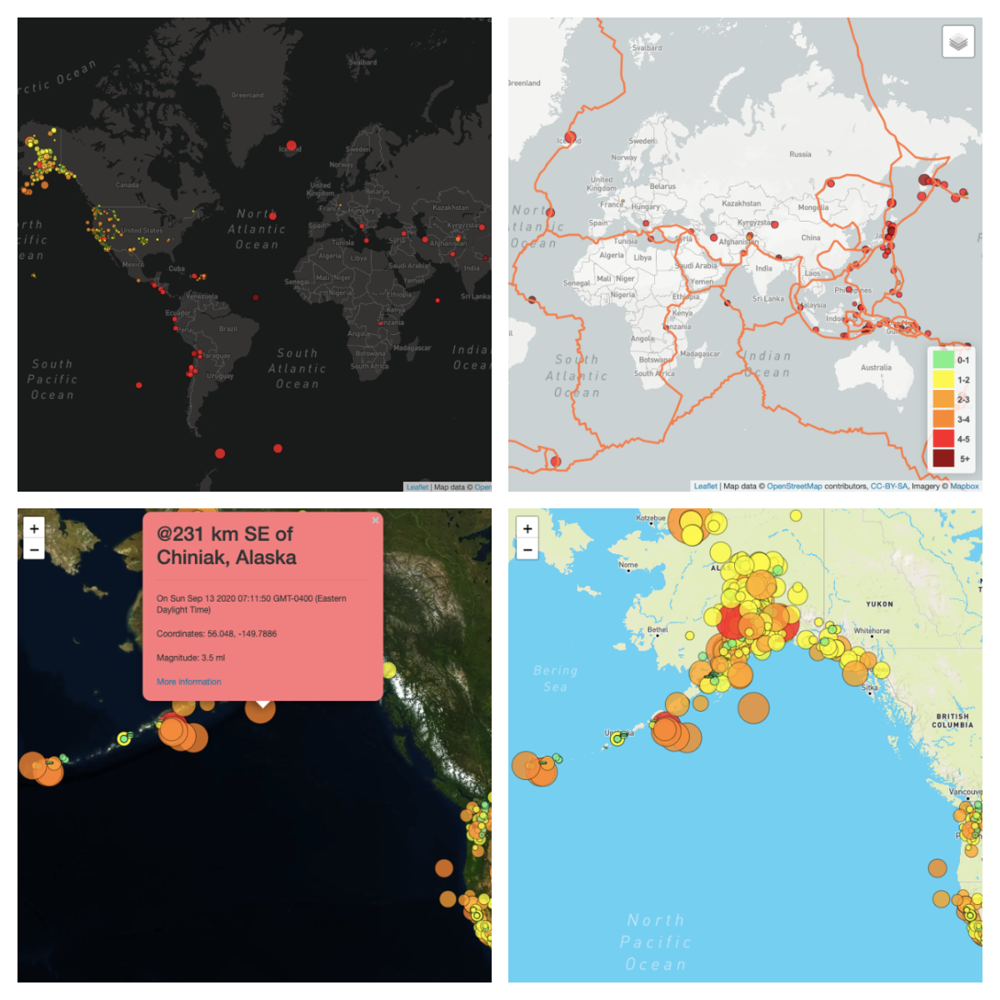

# Visualizing EarthQuake Data with Leaflet
United States Geological Survey (USGS)[https://www.usgs.gov/]  is responsible for providing scientific data about natural hazards, the health of our ecosystems and environment; and the impacts of climate and land-use change. In this project, we retrieve and visualize the USGS data to better educate the public and other government organizations through appealing visuals using (leaflet.JS)[https://leafletjs.com/] and (mapbox api)[https://www.mapbox.com/]. Along with the earthquake data, we also overlay a map to illustrate the relationship between tectonic plates and seismic activity for better insights.

## Data retrieval

- All Earthquakes from the Past 7 Days from [USGS GeoJSON Feed](http://earthquake.usgs.gov/earthquakes/feed/v1.0/geojson.php)
- Data on tectonic plates from <https://github.com/fraxen/tectonicplates>

## Features of the Dashboard

- 4 kinds of Basic map layers (tiles) to be chosen from
- 2 overlaid data (Earthquake and Tectonicplates)
- Legend for better insights
- Tooltip with granular information

## Application is deployed at

- - -

